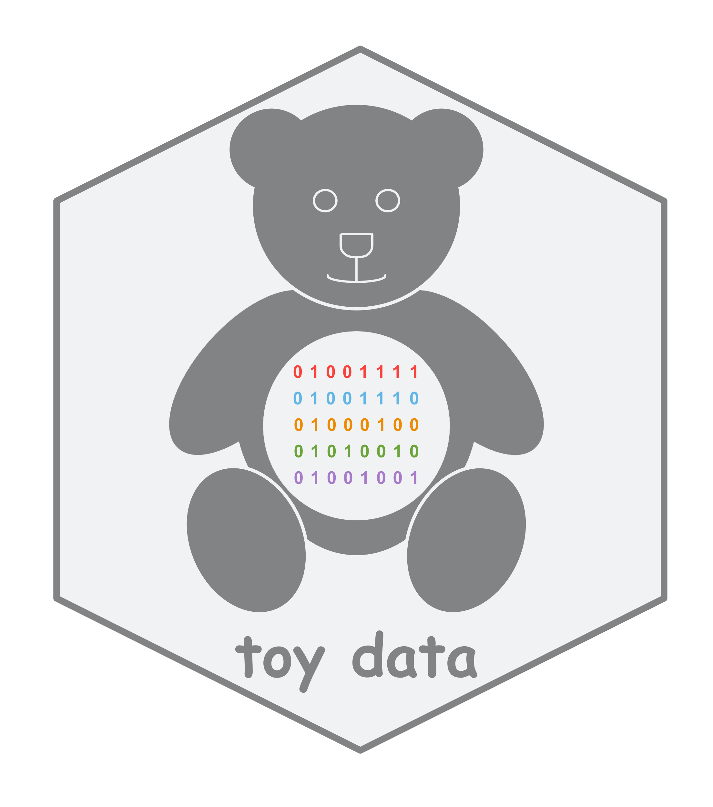

README
================

# toy data 

This repository holds examples of ‘toy data’ in the structure and format
of typical ONDRI data. More details forthcoming

# Contributions and credits

## toy data creators

A list of individuals who created the toy data:

  - Ningcan (Vonna) Sun

  - Jedid Ahn

  - Derek Beaton
